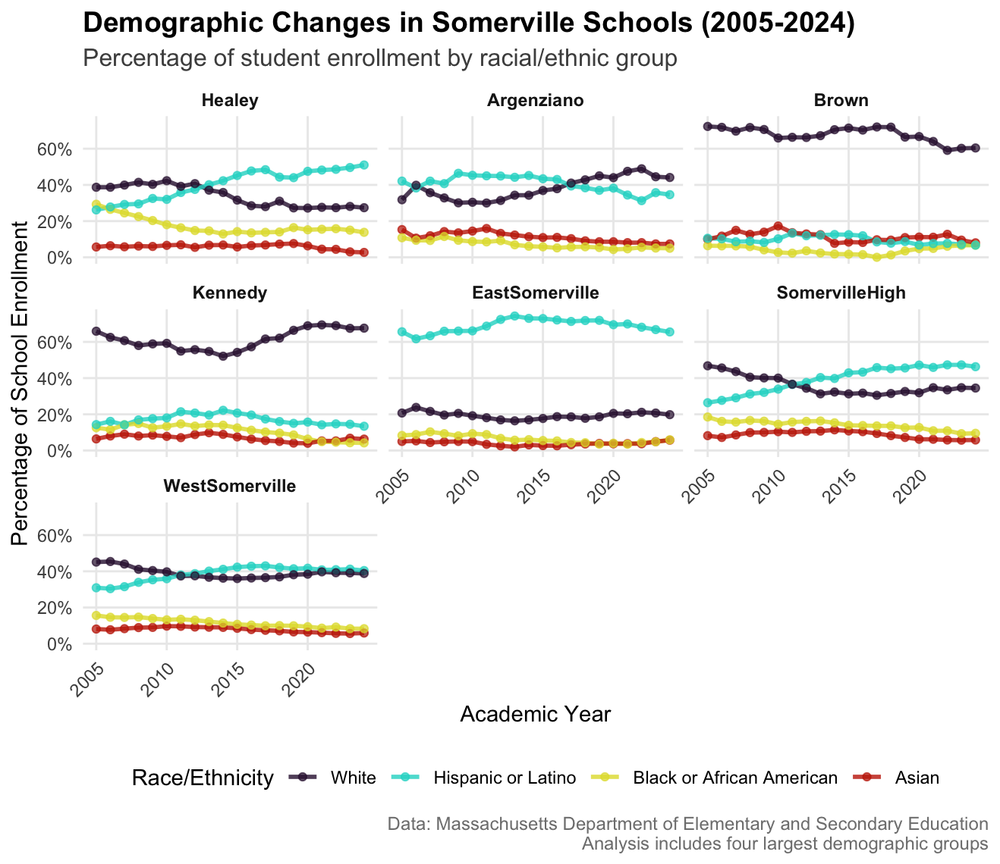

# Tracking Demographics in Somerville Schools: A Decade of Change

When families choose schools for their children, patterns emerge. This analysis examines demographic shifts across Somerville, Massachusetts elementary schools from 2012 to 2022, using systematic data collection and visualization to understand how enrollment patterns evolve over time in school choice environments.

The story begins with the Arthur D. Healey School, which underwent a significant transformation during this period. Originally divided into two programs within one building—a "choice" school with active parent involvement, project-based learning, and arts integration alongside a traditional neighborhood school—the Healey merged these programs in pursuit of educational equity. This natural experiment provided an opportunity to track how demographic patterns respond to programmatic changes, offering insights valuable for educators, administrators, and education technology platforms seeking to understand enrollment dynamics.

## What the Data Reveals



**Predictable patterns in family school selection.** The data reveals distinct demographic clustering across schools, suggesting that family school choice decisions follow identifiable patterns. Understanding these patterns could inform how education platforms present school information, design recommendation algorithms, or structure choice support tools for families.

**Technology-enabled choice amplifies demographic sorting.** Somerville's online enrollment system, which allows families to rank preferences across all schools, shows how digital platforms can both expand access and inadvertently concentrate certain populations. This has implications for how ed-tech companies design choice interfaces and information systems.

**Real-time demographic monitoring is essential.** The analysis demonstrates the value of continuous demographic tracking rather than annual snapshots. Schools experiencing rapid demographic shifts need data systems that can identify trends early, enabling proactive program adjustments and resource allocation.

**Data visualization reveals hidden patterns.** Traditional enrollment reports often obscure temporal trends and between-school comparisons. This project demonstrates how thoughtful data presentation can make demographic patterns accessible to educators, families, and administrators who need to understand enrollment dynamics.

## Methodology

This analysis employed systematic web scraping techniques to collect enrollment data from the Massachusetts Department of Education's school profile system. The methodology involved three key technical components: automated data collection, robust error handling, and longitudinal data harmonization.

**Data Collection Strategy.** I developed a comprehensive scraping framework using R's rvest package to systematically collect demographic data from Massachusetts DOE school profile pages. The system constructs URLs for each school-year combination, extracts enrollment tables, and handles the inconsistent data formats across different years. Each page contains detailed breakdowns by race/ethnicity, gender, and grade level, requiring careful parsing to ensure data consistency.

**Web Scraping Implementation.** The scraping process utilizes a multi-step approach beginning with URL generation using school codes and fiscal year parameters. For each target page, the system extracts HTML tables containing enrollment by race/ethnicity data, processes the tabular structure to handle merged cells and formatting inconsistencies, and implements robust error handling for missing pages or changed data structures. The system also includes built-in delays and retry logic to respect server resources and ensure reliable data collection.

**Data Harmonization Challenges.** One of the most significant technical challenges involved reconciling data format changes across the decade-long study period. The Massachusetts DOE modified their reporting categories several times, requiring careful mapping of demographic categories across years. For example, "Multi-Race" categories were introduced partway through the study period, and Hispanic/Latino reporting standards evolved. The final dataset standardizes these categories while preserving the original granularity where possible.

**Quality Assurance Process.** Each scraped dataset underwent validation checks including total enrollment verification against published district reports, demographic percentage calculations to ensure internal consistency, and manual spot-checks of source pages for representative schools and years. Missing data was carefully documented and handled through interpolation only where appropriate, with clear documentation of any assumptions made.

## Applications for Education Technology

These findings have direct implications for how education technology companies approach enrollment systems, data analytics, and family engagement platforms. The demographic patterns revealed suggest several opportunities for technological innovation in the education space.

**Enrollment and Choice Platforms.** Ed-tech companies developing school choice applications can learn from how demographic sorting occurs even in well-designed systems. The data suggests that choice platforms should consider how information presentation, recommendation algorithms, and user interface design might inadvertently influence family decisions. Features like demographic information display, school comparison tools, and application guidance systems all play roles in shaping enrollment patterns.

**Analytics and Dashboard Development.** The project demonstrates the value of longitudinal demographic tracking for school administrators and district leaders. Education technology platforms providing analytics services could develop more sophisticated demographic monitoring tools that identify trends early and alert administrators to emerging patterns. Real-time enrollment dashboards could help schools make proactive adjustments to programming and outreach.

**Family Engagement Tools.** Understanding how different demographic groups navigate school choice can inform the development of more effective family engagement platforms. The patterns suggest that targeted communication strategies and multilingual support systems could help ensure equitable access to school information and choice processes.

**Data Integration and Visualization.** This analysis showcases how systematic data collection and visualization can reveal insights hidden in traditional reporting formats. Ed-tech companies working with school districts could develop similar longitudinal analysis capabilities, helping educators understand their enrollment dynamics and make data-informed decisions about programming and resource allocation.

## Technical Innovation and Industry Applications

This project showcases several technical approaches that are directly applicable to education technology development. The web scraping framework demonstrates how to systematically collect data from government sources that don't provide APIs or bulk downloads—a common challenge for ed-tech companies seeking to integrate public education data into their platforms.

The automated data collection system developed here could serve as a model for ed-tech companies needing to aggregate information from multiple districts or states. Many education platforms require demographic and enrollment data to provide valuable services to schools and families, but accessing this information often requires custom scraping solutions for each jurisdiction.

The longitudinal analysis approach reveals patterns that single-year snapshots miss entirely. Education technology platforms providing analytics services could implement similar time-series analysis capabilities to help schools understand their enrollment trends and demographic shifts. This type of longitudinal insight is particularly valuable for charter school networks, district choice offices, and family engagement platforms that need to understand how enrollment patterns evolve.

The data visualization strategies employed here demonstrate how to make complex demographic trends accessible to non-technical audiences. This presentation approach could inform how ed-tech companies design dashboards and reporting tools for school administrators, helping them quickly identify important patterns in their enrollment data.

## Repository Structure

```
somerville-school-demographics/
├── README.md
├── docs/
│   ├── methodology.md
│   ├── data_codebook.md
│   └── ma_doe_documentation.pdf
├── code/
│   ├── scraping_framework.R
│   ├── data_cleaning.R
│   ├── demographic_analysis.R
│   └── visualization.R
└── results/
    ├── cleaned_datasets/
    ├── demographic_trends/
    └── comparative_analysis/
```

The analysis was conducted entirely in R using web scraping (rvest), data manipulation (tidyverse), and visualization (ggplot2) packages. The scraping framework includes robust error handling and retry logic to ensure reliable data collection across multiple years and schools.

**Data Source:** Massachusetts Department of Education School Profiles  
**Methods:** Systematic web scraping and longitudinal demographic analysis  
**Focus:** School choice, integration, and demographic trends in public education
